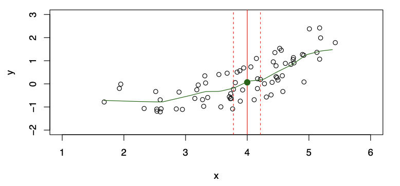
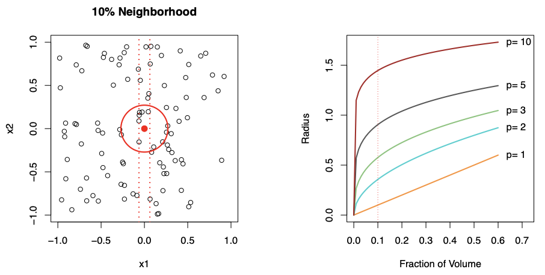
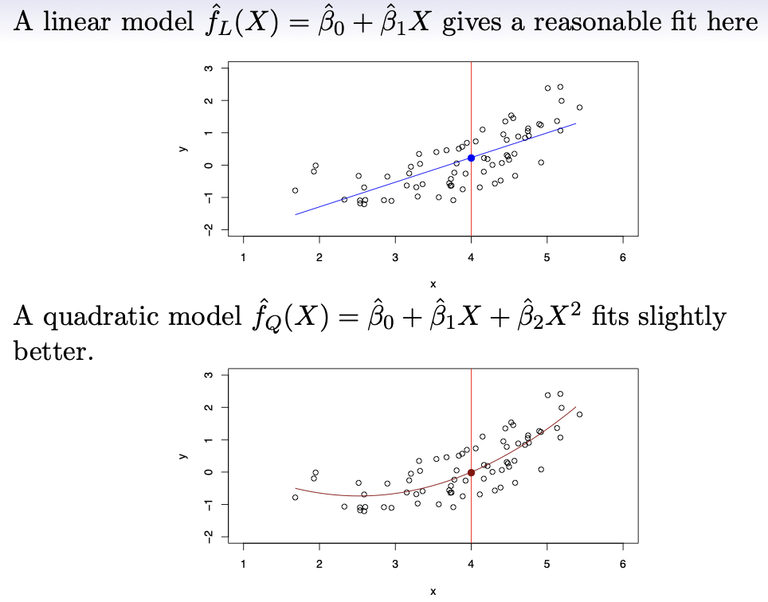
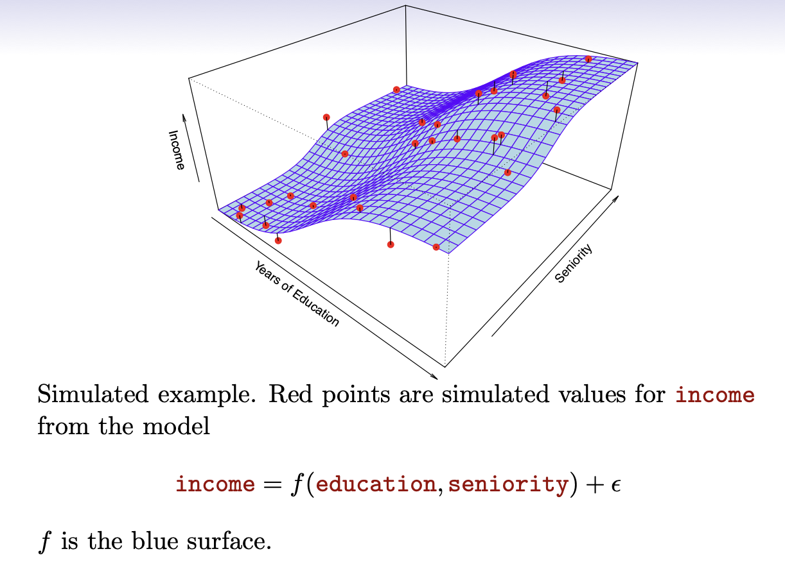
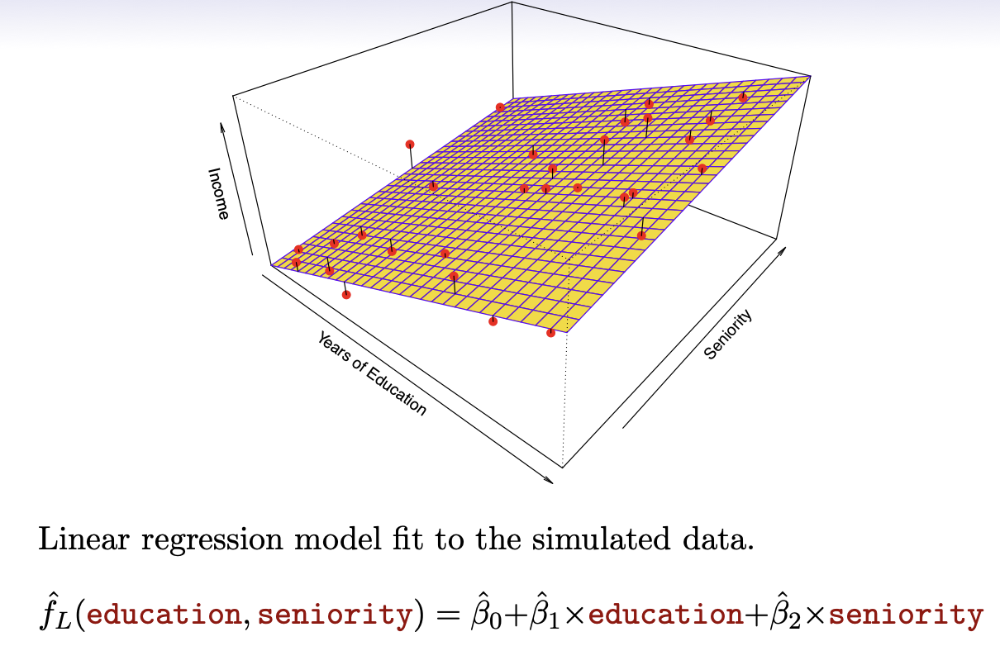
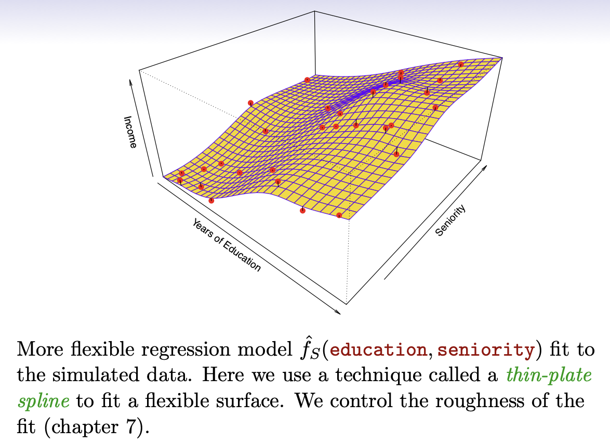
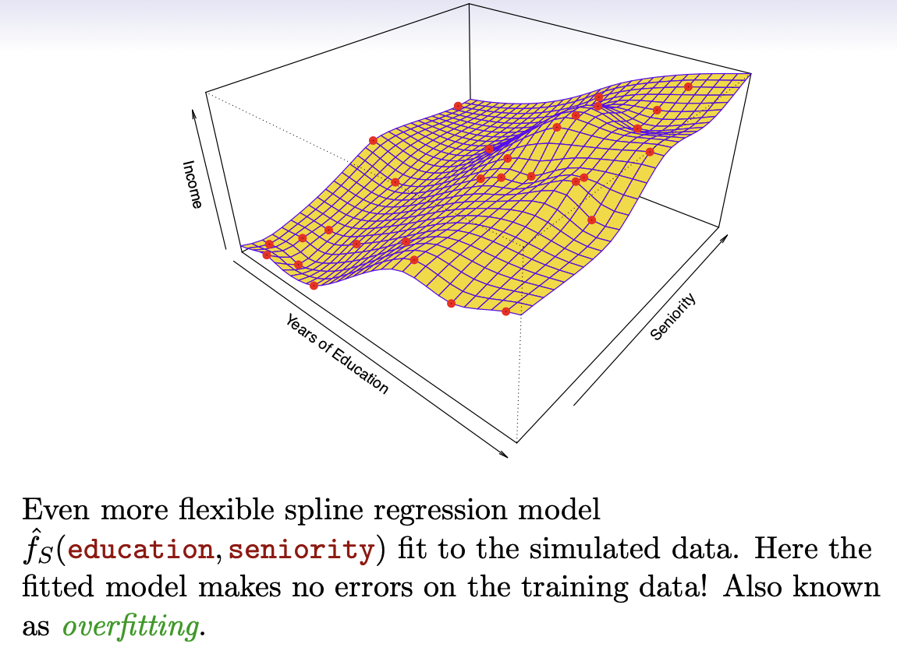
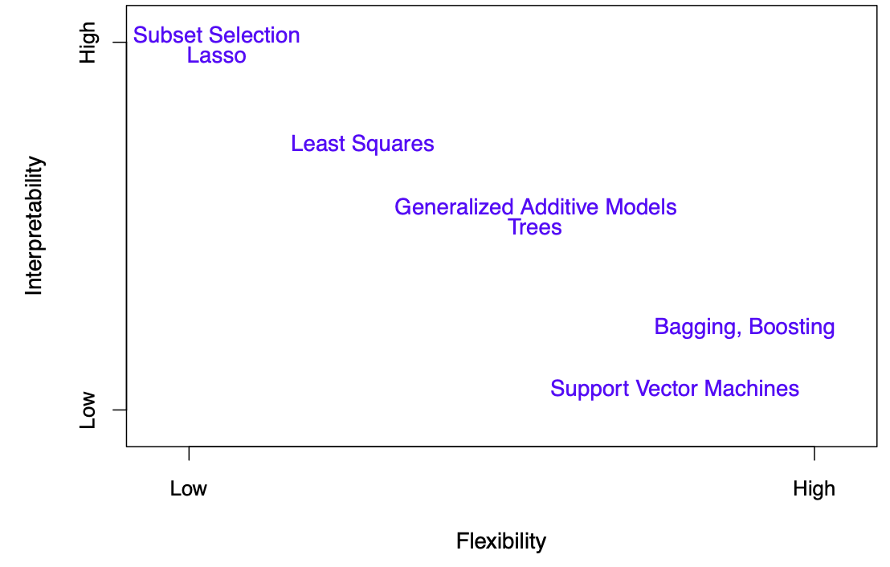

# regression modelling

**Author:** lyl  
**Date:** 2026-03-24 to 2026-03-25

---
# 2.1 What is regression modelling ?


Image 1 shows that Sales(Y) have a linear regression line with TV($`X_1`$), Radio($`X_2`$) and Newspaper($`X_3`$) fit to each.

We want to predict Sales using these 3 predictors.

So the model is : Sales ≃ f(TV,Radio,Newspaper).

Here Sales(Y) is a response or target we wish to predict.  
TV is a predictor or feature or input, we name it $`X_1`$, likewise Radio and Newspaper are $`X_2`$ and $`X_3`$, respectively.

Then the input vector collectively as $`X = (x_1, x_2, x_3)^T`$

Now we can write our model as $`Y = f(X) + \epsilon`$  
where $`\epsilon`$ is the error. It captures the measurement errors maybe in Y and other discrepancies. Because the model never predict Y perfectly.

A good $`f(X)`$ can make a prediction of Y at a new point $`X = x`$.  
We can also understand which components of $`X = (x_1, x_2, x_3, ... , x_p)^T`$ are important in explaining Y, and which are irrelevant. Depending on the complexity of $`f`$, we may be able to understand how $`x_p`$ affects Y.

In ideal $`f(X)`$, $`f(4) = E(Y \mid X=4)`$, where $`E(Y \mid X=4)`$ means expected value of Y given $`X=4`$(Y在X=4条件下的期望值).

$`f(x) = E(Y \mid X=x)`$ is called the regression function.  
$`f(x) = f(x_1, x_2, x_3) = E(Y \mid X_1=x_1, X_2=x_2, X_3=x_3)`$

The ideal or optimal predictor of Y with regard to mean-squared prediction error(MSE,均方误差): $`f(x) = E(Y \mid X=x)`$ is the function that minimizes $`E[(Y-g(X))^2 \mid X=x]`$ overall function g at all points $`X=x`$.

$`\epsilon = Y - f(x)`$ is the irreducible error（不可约误差）. 对于同一个$`X=x`$, Y通常不是唯一固定的, 而是有一个可能取值的分布.

For any estimate $`\hat{f}(x)`$ of $`f(x)`$,

Assume

```math
Y = f(X) + \epsilon, \qquad f(x)=E(Y\mid X=x), \qquad E(\epsilon\mid X)=0.
```

Then for any estimate $`\hat f`$,

```math
E[(Y-\hat f(X))^2 \mid X=x]
=
E[(f(x)+\epsilon-\hat f(x))^2 \mid X=x].
```

Expand the square:

```math
E[(Y-\hat f(X))^2 \mid X=x]
=
E[(f(x)-\hat f(x))^2
+2(f(x)-\hat f(x))\epsilon
+\epsilon^2
\mid X=x].
```

Since $`f(x)-\hat f(x)`$ is a constant given $`X=x`$,

```math
=
(f(x)-\hat f(x))^2
+2(f(x)-\hat f(x))E(\epsilon\mid X=x)
+E(\epsilon^2\mid X=x).
```

Because

```math
E(\epsilon\mid X=x)=0
```

the middle term vanishes, so

```math
=
(f(x)-\hat f(x))^2 + E(\epsilon^2\mid X=x).
```

And since

```math
\mathrm{Var}(\epsilon\mid X=x)
=
E(\epsilon^2\mid X=x)-[E(\epsilon\mid X=x)]^2
```

with $`E(\epsilon\mid X=x)=0`$, we get

```math
E(\epsilon^2\mid X=x)=\mathrm{Var}(\epsilon\mid X=x)
```

Therefore,

```math
E[(Y-\hat f(X))^2 \mid X=x]
=
[f(x)-\hat f(x)]^2+\mathrm{Var}(\epsilon\mid X=x)
```

This shows that the expected prediction error can be decomposed into two parts:

1. **Reducible error**

   $`[f(x)-\hat{f}(x)]^2`$

   This part comes from the fact that $`\hat{f}(x)`$ is only an estimate of the true function $`f(x)`$.

2. **Irreducible error**

   $`\mathrm{Var}(\epsilon)`$

   This part comes from the inherent randomness in $`Y`$, and cannot be eliminated even if $`f(x)`$ were known exactly.
   
- how to estimate Y ?

Typically we have few data points with $`X = 4`$ exactly, so we can not compute $`f(x) = E(Y \mid X=x)`$ directly.

- Solution :



- Relax the definition :

```math
\hat f(x)=\mathrm{Ave}(Y\mid X\in \mathcal N(x))
```
---

# 2.2 Dimensionality and Structured Models.

- nearest neighbor averaging(最近邻平均) can be pretty good for small $`p(p≤4)`$, where $`p`$ is the dimensions of $`X`$. 
- when the $`p`$ is large, nearest neighbor methods can be lousy(糟糕的).
- Reason : curse of dimensionality（维度灾难）。当维度变高后，数据的分布会变得很稀疏，即使是最近邻，大概率也相隔很远。也就是说：在高纬度的情况下，很难做到真正的局部。因此这个方法就失效了，因为只有在我们取到的是真正的近邻的时候才有效果。



- 从图片中可以看到，如果想取到0.1的邻域，随着维度的升高，半径会越来越大。
- to solve this problem, we introduce structure model, and the simplest one is linear model.
```math
f_L(X) = \beta_0 + \beta_1 X_1 + \beta_2 X_2 + \cdots + \beta_p X_p
```
- in a p-dimensional question, linear model will have $`p+1`$ parameters($`\beta_0,\beta_1,\beta_2...\beta_p`$).
- we estimate parameters by fitting the model to training data.
- although it is never correct, a linear model often serves as a good and interpretable approximation to the unknown true function f(X).



- then let's look an example:



- the linear regression model is:



- 线性模型非常简单，结构很强，比较稳定，但表达能力有限。我们可以采取更加平滑的模型，比如允许模型是曲面，像下面这样：



- 这里我们用的方法叫做“thin-plate spline”(薄板样条)。当然也可以使用更加灵活的模型，比如下面这个：



- 我们可以看到这个模型已经完美拟合了每一个样本数据，每一个样本点都被模型穿过。但实际上这叫做overfitting(过拟合)。也就是说，模型不仅学习真实规律，并且还把随机噪声，
偶然波动也当成规律学习了，这造成了模型的曲面非常扭曲，出现了不必要的弯折，模型非常复杂，这往往导致模型表现不佳。这就相当于模型把训练数据给背了下来，但是不等同于掌握了变化的规律。

- 因此我们在选择模型的时候往往要做出权衡和取舍。

- Prediction accuracy (准确性) or Interpretability（可解释性）.
- Good fit （过拟合）or under fit（欠拟合）.
- Parsimony（简洁）or black-box（黑盒）.



---

