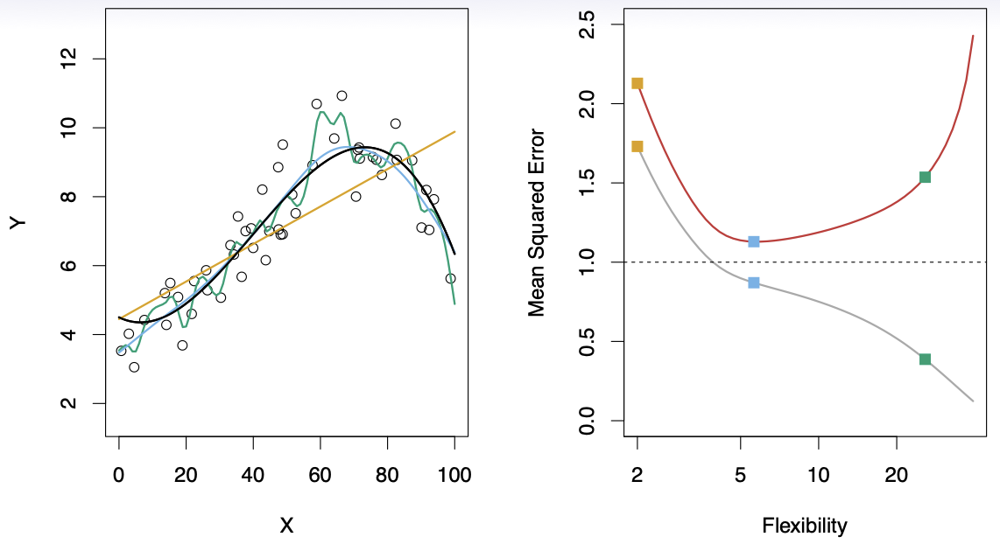
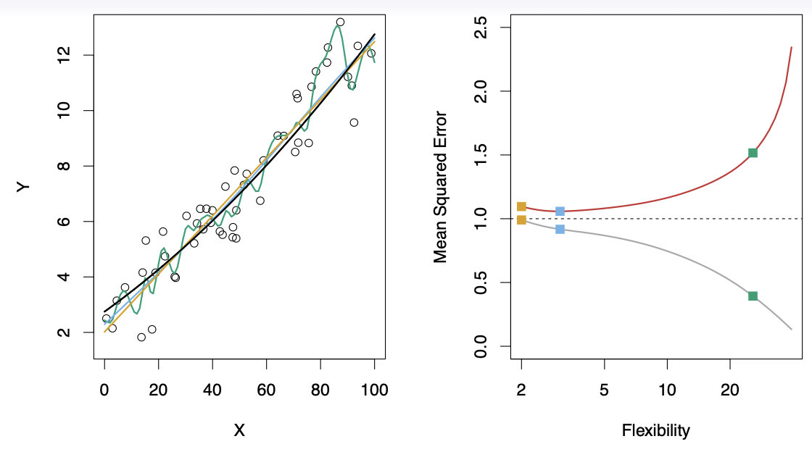
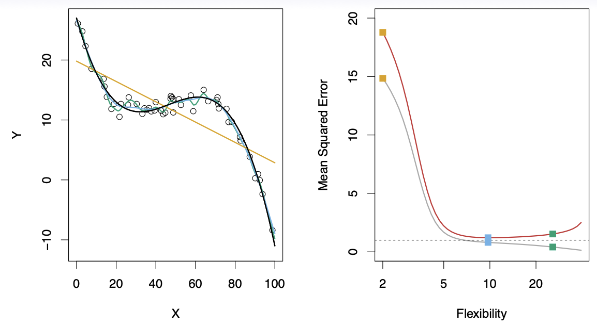
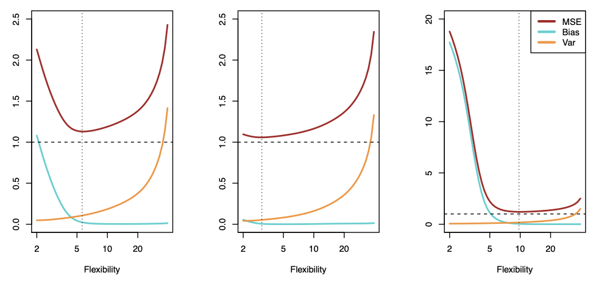

# Model Selection and Bias-Variance Tradeoff

**Author:** lyl  
**Date:** 2026-03-25

---

# 1. Accessing Model Accuracy

- Suppose we fit a model $`\hat{f}(x)`$ to some training data, where $`Tr = {x_i, y_i}_1^N`$. And we wish to see how well this model performs.
- We can compute the average squared prediction error
over Tr:
```math
{MSE}_{Tr} = {Ave}_{i \in {Tr}} [y_i - \hat{f}(x_i)]^2
```
- For overfitting model MSE=0, so if possible, compute it using fresh *test* data $`{Te} = {x_i, y_i}_1^M`$:
```math
{MSE}_{Te} = {Ave}_{i \in {Te}} [y_i - \hat{f}(x_i)]^2
```

- 比如在这个例子中，黑色的是真正的函数，绿色的这条是过拟合的曲线，黄色是线性回归模型，蓝色是一个非常棒的预测模型。我们可以看到，左边MSE的曲线，灰色的Tr是一直下降的，红色的Te则是先下降后上升，绿色曲线的$`MSE_{Te}`$很高，$`MSE_{Tr}`$很低。综合两条MSE的曲线，蓝色模型表现最棒。下面是一个更夸张的例子：

- 有的时候过拟合的效果非常好，也就是噪音很小的时候，比如下面这个情况：


---

# 2. Bias-Variance Tradeoff/偏差-方差权衡

- Expected Test MSE (期望测试均方误差)
```math
E(y_0 - \hat{f}(x_0))^2 = \text{Var}(\hat{f}(x_0)) + [\text{Bias}(\hat{f}(x_0))]^2 + \text{Var}(\epsilon)
```
- where $`[\text{Bias}(\hat{f}(x_0))] = E(\hat{f}(x_0) - f(x_0))`$
- 随着模型灵活性（复杂度）的增加，模型能够更好的捕捉数据的形状，因此偏差减小，相应的，对于训练数据更加敏感，方差会增大。所以综合考虑，我们要找到方差和偏差综合最小的点，也就是U型图的底部。


---