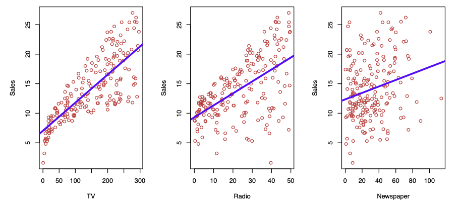

# 1. What is regression modelling ?

figure 1 shown that Sales(Y) have a linear regression line with TV(X_1) and Radio(X_2) and Newspaper(X_3) fit to each.

We want to predict Sales using these 3 predictors.

So the model is : Sales ≃ f(TV,Radio,Newspaper).

Here Sales(Y) is  a response or target we wish to predict.
TV is a predictor or feature or input, we name it X_1, likewise Radio and Newspaper are X_2 and X_3, respectively.

Then the input vector collectively as \(X = (x_1, x_2, x_3)^T\)

Now we can write our model as Y = f(X) + 𝛜
where 𝛜 is the error. It captures the measurement errors maybe in Y and other discrepancies. Because the model never predict Y perfectly.

A good f(X) can make a prediction of Y at a new point X = x.
We can also understand which components of \(X = (x_1, x_2, x_3, ... , x_p)^T\) are important in explaining Y, and which are irrelevant. Depending on the complexity of f, we may be able to understand how x_p affects Y.

In ideal f(X),f(4) = E(Y|X=4), where E(Y|X=4) means expected value of Y given X=4(Y在X=4条件下的期望值).

f(x) = E(Y|X=x) is called the regression function.
f(x) = f(x_1, x_2, x_3) = E(Y|X_1=x_1, X_2=x_2, X_3=x_3)

The ideal or optimal predictor of Y with regard to mean-squared prediction error(MSE,均方误差): f(x) = E(Y|X=x) is the function that minimizes E[(Y-g(X))^2|X=x] overall function g at all points X=x.

---